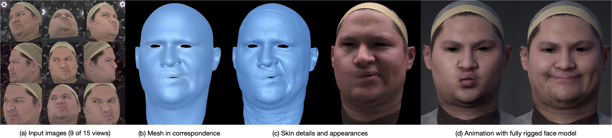

# ToFu: Topologically Consistent Multi-View Face Inference Using Volumetric Sampling (ICCV 2021 oral)



This is the official repository for [our paper](https://openaccess.thecvf.com/content/ICCV2021/papers/Li_Topologically_Consistent_Multi-View_Face_Inference_Using_Volumetric_Sampling_ICCV_2021_paper.pdf) at ICCV 2021. For more information, please check the [project page](https://tianyeli.github.io/tofu).


## TL;DR

- This repo demonstrates the ToFu (base) framework that infers a dense registration mesh for face, directly from the multi-view image input (with known camera calibration), without the need for photogrammetry or mesh registration.

- We currently provide a subset of Light Stage test data for this demo.

- We will also release training and testing codes on the [CoMA datasets](https://coma.is.tue.mpg.de/).


## Abstract

High-fidelity face digitization solutions often combine multi-view stereo (MVS) techniques for 3D reconstruction and a non-rigid registration step to establish dense correspondence across identities and expressions. A common problem is the need for manual clean-up after the MVS step, as 3D scans are typically affected by noise and outliers and contain hairy surface regions that need to be cleaned up by artists. Furthermore, mesh registration tends to fail for extreme facial expressions. Most learning-based methods use an underlying 3D morphable model (3DMM) to ensure robustness, but this limits the output accuracy for extreme facial expressions. In addition, the global bottleneck of regression architectures cannot produce meshes that tightly fit the ground truth surfaces. We propose ToFu, Topological consistent Face from multi-view, a geometry inference framework that can produce topologically consistent meshes across facial identities and expressions using a volumetric representation instead of an explicit underlying 3DMM. Our novel progressive mesh generation network embeds the topological structure of the face in a feature volume, sampled from geometry-aware local features. A coarse-to-fine architecture facilitates dense and accurate facial mesh predictions in a consistent mesh topology. ToFu further captures displacement maps for pore-level geometric details and facilitates high-quality rendering in the form of albedo and specular reflectance maps. These high-quality assets are readily usable by production studios for avatar creation, animation and physically-based skin rendering. We demonstrate state-of-the-art geometric and correspondence accuracy, while only taking 0.385 seconds to compute a mesh with 10K vertices, which is three orders of magnitude faster than traditional techniques. The code and the model are available for research purposes at [https://tianyeli.github.io/tofu](https://tianyeli.github.io/tofu).


## Setup

Tested in Python 3.7.

The ICCV 2021 version was done with pytorch 1.4.0, torchvision 0.5.0, cudatoolkit 10.1.

Create conda environment: `conda create -n tofu python=3.7` or other virtual environment that you like.

Before running:
```
conda activate tofu
export PYTHONPATH=$PYTHONPATH:$(pwd)
```


### Installation

```
pip install imageio
pip install pyyaml
pip install scikit-image
conda install -c menpo opencv
```

Then install [PyTorch](https://pytorch.org/get-started/locally/) that fits your system.

Finally, you need to manually install [MPI-IS mesh package](https://github.com/MPI-IS/mesh).


## Models and Data

Please request the dataset and trained model via [this website](https://vgl.ict.usc.edu/Software/ToFu/).

Download the trained model files `tofu_models.zip` and the LightStage demo data `LightStageOpenTest.zip`.

Unzip both folders to `./data`.


## Demo

Note: The current codes run the global and local stage separately (and sequentially).


**1. Test on LightStage demo data**
```
# Run the global stage:
$ python tester/test_sparse_point.py -op configs/test_ls_sparse.json
# The results will be saved to ./results/sparse_model_run_sparse_model_15_views

# Then run the local stage:
$ python tester/test_dense_point_known_sparse_input.py -op configs/test_ls_dense_known_sparse_input.json
# The results will be saved to ./results/dense_model_run_dense_model_15_views
```


**2. Train/test on CoMA data**

*TBA*


## License

Please see `LICENSE` for details.


## Citation

If you use code or data from this repository please consider citing:

```commandline
@inproceedings{li2021tofu,
  title={Topologically Consistent Multi-View Face Inference Using Volumetric Sampling},
  author={Li, Tianye and Liu, Shichen and Bolkart, Timo and Liu, Jiayi and Li, Hao and Zhao, Yajie},
  booktitle={Proceedings of the IEEE/CVF International Conference on Computer Vision},
  pages={3824--3834},
  year={2021}
}
```